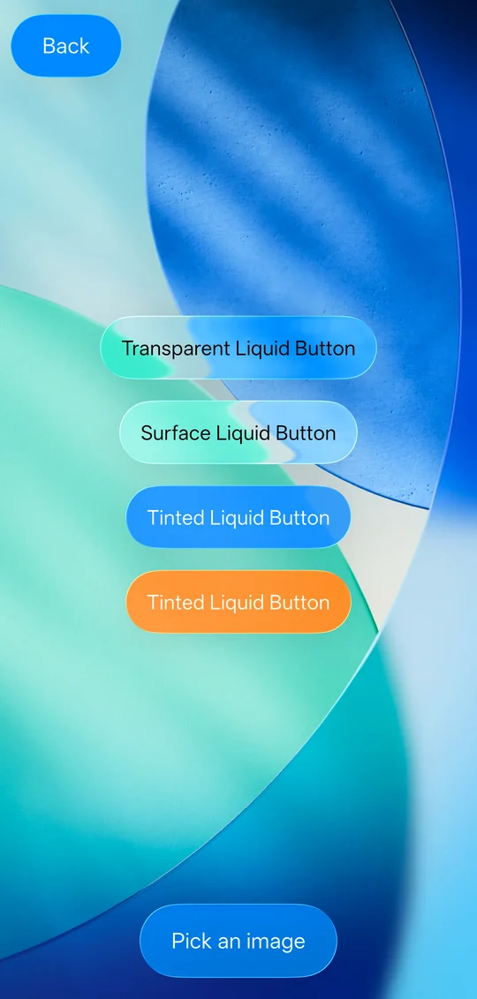
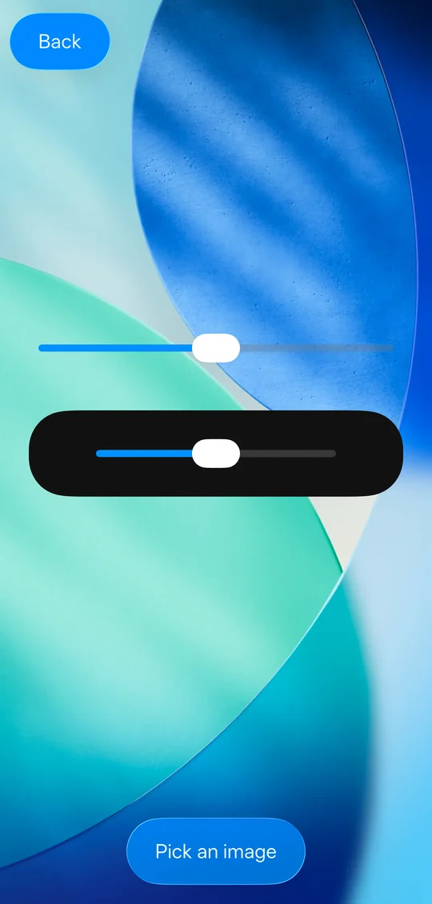
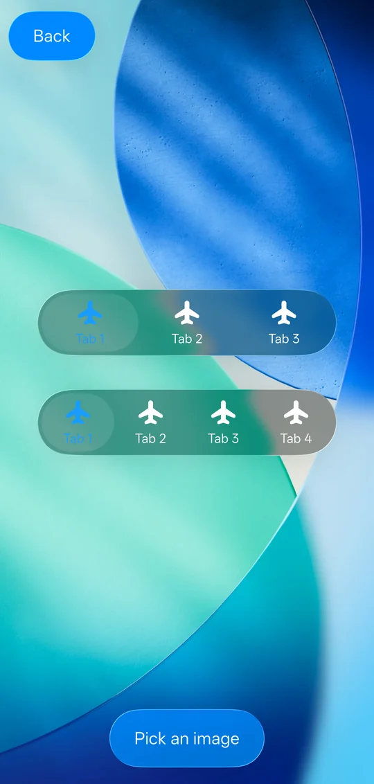
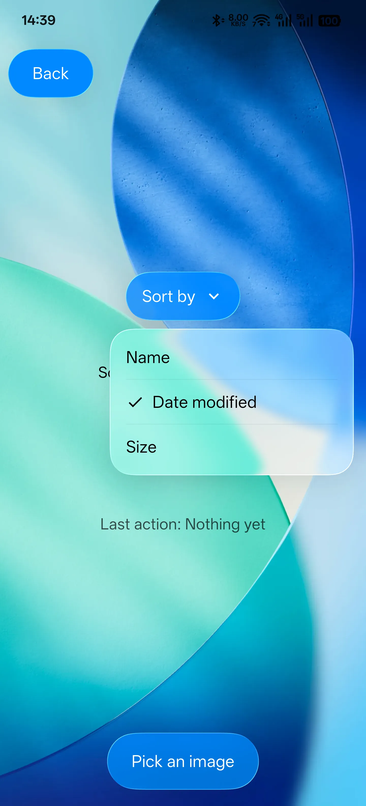
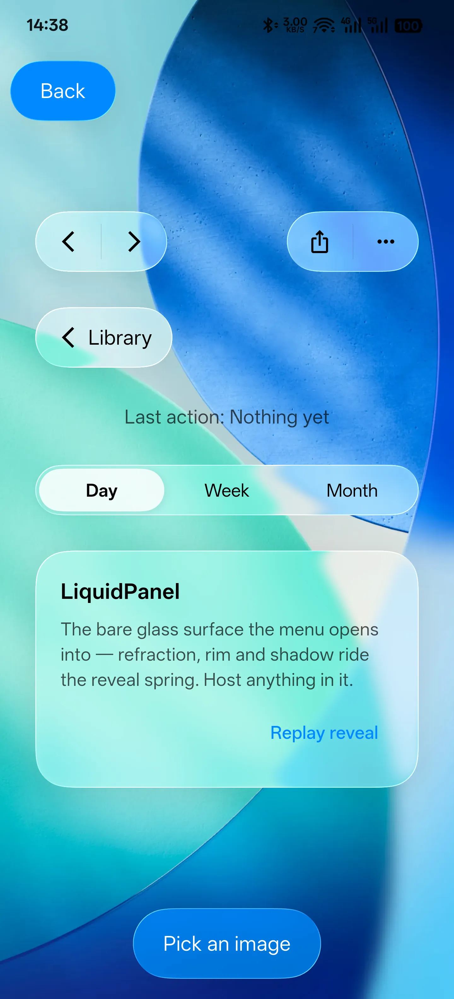
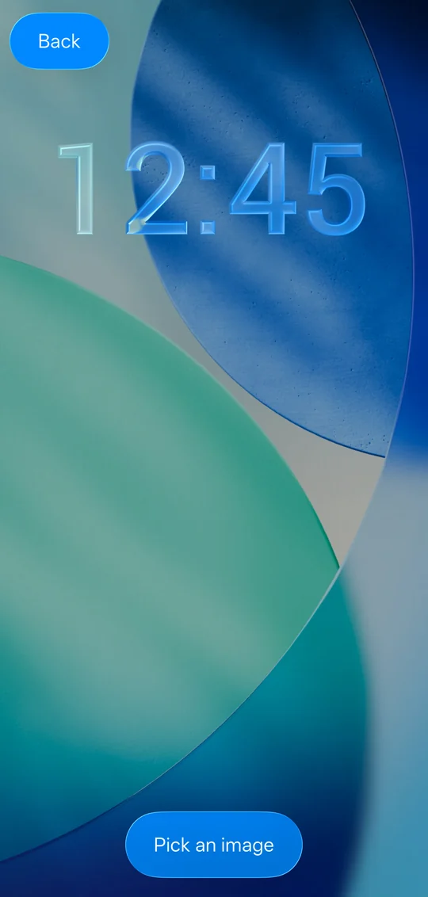
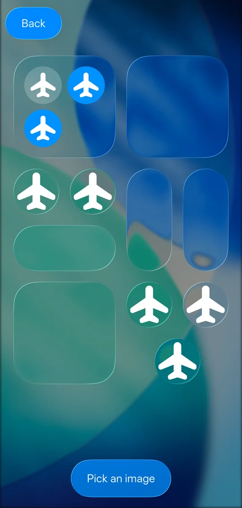
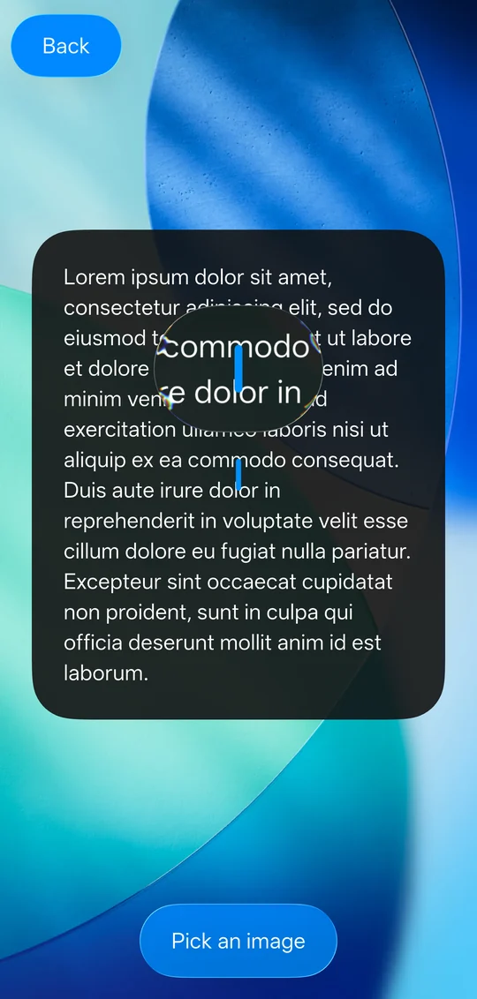

# FluidGlass

A customizable Liquid Glass effect library for Flutter — a port of
[Kyant0/AndroidLiquidGlass](https://github.com/Kyant0/AndroidLiquidGlass)
(`backdrop`) together with the continuous-corner shapes from
[Kyant0/Shapes](https://github.com/Kyant0/Shapes).

The refraction, dispersion, highlight and shadow maths are carried over from the
original AGSL and Kotlin sources unchanged, so a given set of parameters
produces the same picture on both platforms. See
[THIRD_PARTY_NOTICES.md](THIRD_PARTY_NOTICES.md) for the file-by-file mapping.

## The demo

Captured on a 1440x3168 device. `example/` is the Backdrop Catalog, all fifteen
screens: buttons, toggle, slider, bottom tabs, menu, dialog, lock screen (SDF
texture), control centre, magnifier, glass playground, adaptive-luminance
glass, progressive blur and the two scroll containers.

| Buttons | Slider | Bottom tabs |
| --- | --- | --- |
|  |  |  |

| Menu | Toolbar & controls | Lock screen |
| --- | --- | --- |
|  |  |  |

| Control centre | Magnifier |
| --- | --- |
|  |  |

## Requirements

The refraction and highlight effects run on fragment shaders through
`dart:ui`'s `ImageFilter.shader`, which needs the **Impeller** renderer. On a
backend without it, `isRuntimeShaderSupported()` returns false and glass
elements fall back to their blur/tint appearance instead of throwing.

## Usage

Wrap whatever the glass should refract in a `BackdropLayer`, then draw glass
over it:

```dart
final LayerBackdrop backdrop = LayerBackdrop();

Stack(
  children: <Widget>[
    Positioned.fill(
      child: BackdropLayer(
        backdrop: backdrop,
        child: Image.asset('wallpaper.webp', fit: BoxFit.cover),
      ),
    ),
    Center(
      child: DrawBackdrop(
        backdrop: backdrop,
        shape: () => const Capsule(),
        effects: (BackdropEffectScope scope) => scope
          ..vibrancy()
          ..blur(2)
          ..lens(12, 24),
        onDrawSurface: (Canvas canvas, Size size) => canvas.drawRect(
          Offset.zero & size,
          Paint()..color = const Color(0x40FFFFFF),
        ),
        child: const Padding(
          padding: EdgeInsets.symmetric(horizontal: 16, vertical: 12),
          child: Text('Liquid Glass'),
        ),
      ),
    ),
  ],
)
```

`FluidGlass.ensureInitialized()` preloads the fragment programs; awaiting it in
`main` avoids one unrefracted first frame. It is optional — they load on first
use either way.

### Effects

Effects are applied in the order you call them.

| Effect | What it does |
| --- | --- |
| `blur(radius, {edgeTreatment})` | Gaussian blur. `radius` is an Android-style radius, converted internally to Flutter's sigma. |
| `lens(refractionHeight, refractionAmount, {depthEffect, chromaticAberration})` | Bends the backdrop inwards along the edge. |
| `colorControls({brightness, contrast, saturation})` | Colour matrix. |
| `vibrancy()` | `colorControls(saturation: 1.5)`. |
| `opacity(alpha)` | Scales the backdrop's alpha. |
| `colorFilterEffect(filter)` | Any `ColorFilter`. |
| `imageFilterEffect(filter)` | Any `ImageFilter`. |
| `fragmentShaderEffect(key, program, configure)` | Your own shader. |

A custom shader must declare a `vec2` first uniform (the engine overwrites it
with the input texture size) and at least one `sampler2D` (the engine binds the
chain's current output to the first one). `shaders/refraction.frag` is a
worked example.

### Decoration

`DrawBackdrop` draws, in order: the drop shadow, `onDrawBehind`, the filtered
backdrop, `onDrawSurface`, the `child`, `onDrawFront`, the highlight rim and the
inner shadow. Everything from `onDrawBehind` to `onDrawFront` is clipped to
`shape`.

- `highlight` — `Highlight.standard` (lit from 45°), `Highlight.ambient`
  (white on the lit side, black on the other) or `Highlight.plain`.
- `shadow` — `GlassShadow`, punched out under the element so it never darkens
  what the glass shows.
- `innerShadow` — `GlassInnerShadow`, which reads as thickness.

Pass `null` for any of them, or use `DrawBackdrop.plain` to drop all three.

The two shadows are baked into cached textures and re-baked only when their
*geometry* changes, so animating their `alpha` costs nothing per frame —
animating a `radius` still re-bakes, and the cache detects that and steps back
to drawing directly. The highlight rim is never baked: it is a hairline, and
resampling a cached copy of it is visible.

`isolateSurface` (default true) gives `onDrawSurface` its own save-layer, so
blend modes it uses composite against the refracted backdrop alone. A surface
that only paints src-over produces identical pixels without it — pass false to
save an offscreen pass per frame.

### Animating

`shape`, `effects`, `highlight`, `shadow`, `innerShadow` and `layerBlock` are
evaluated during paint, so they can read animation values directly. Give
`DrawBackdrop` a `repaint` listenable and it repaints without rebuilding:

```dart
DrawBackdrop(
  backdrop: backdrop,
  shape: () => const Capsule(),
  effects: (BackdropEffectScope scope) =>
      scope.lens(10 * animation.value, 14 * animation.value),
  layerBlock: (GlassLayer layer) => layer.scaleX = animation.value,
  repaint: animation,
  child: child,
)
```

`layerBlock` transforms the element *and* counter-transforms what it refracts,
so scaling a glass element does not scale the image inside it.

### Backdrops

| Backdrop | Source of pixels |
| --- | --- |
| `LayerBackdrop` + `BackdropLayer` | A live capture of another part of the tree. |
| `CanvasBackdrop(onDraw)` | A canvas callback, for cheap backgrounds. |
| `CombinedBackdrop.of(a, b, …)` | Several backdrops, drawn in order. |
| `WrappedBackdrop(inner, onDraw)` | Another backdrop, transformed as it is drawn. |
| `emptyBackdrop` | Nothing. |

`DrawBackdrop.exportedBackdrop` fills a `LayerBackdrop` with the element's own
drawing, so glass nested inside it can refract the glass around it.

### Shapes

`Rectangle`, `RoundedRectangle(radius)`, `Capsule()` and
`UnevenRoundedRectangle` default to G2-continuous ("squircle") corners; pass
`style: RoundedCornerStyle.circular` for plain circular ones. `GlassShapeClipper`
and `GlassShapeBorder` adapt them to `ClipPath` and `ShapeDecoration`.

## Running the demo

```sh
cd example
flutter run
```

Setting `FLUID_GLASS_SHOT=<dir>` renders every screen to a PNG and exits, which
is how the screens were checked against the originals;
`FLUID_GLASS_SHOT_SCALE` sets the pixel ratio they are rendered at.

## Implementation notes

Flutter has no modifier chain, so the glass, highlight, shadow and inner shadow
are one render object, drawn in that order. Two details are shaped by the
engine:

- `ImageFilter.shader` is handed the whole input texture, which a preceding blur
  in the same filter would have grown, so each shader effect gets its own
  save-layer. The effect output is therefore clipped to the element's bounds.
- `LayerBackdrop` captures its source once per frame with
  `OffsetLayer.toImageSync`, and every glass element that reads it samples that
  one image. The capture clips hard at the source's bounds — Compose records
  the source's draw commands unclipped — so a transform that shifts content
  past those bounds must sit *outside* the `BackdropLayer`, or the shifted
  edge is sheared off in every glass element that samples it.
- Skia caches blurred masks by path and sigma; Impeller does not, so the
  highlight, shadow and inner shadow are baked into cached textures instead of
  being re-blurred every frame.

## Licence

Apache License 2.0 — see [LICENSE](LICENSE) and [NOTICE](NOTICE). FluidGlass is
a derivative work of two Apache-2.0 projects by
[Kyant](https://github.com/Kyant0);
[THIRD_PARTY_NOTICES.md](THIRD_PARTY_NOTICES.md) records which files derive from
which originals.
